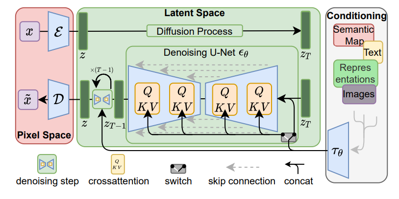
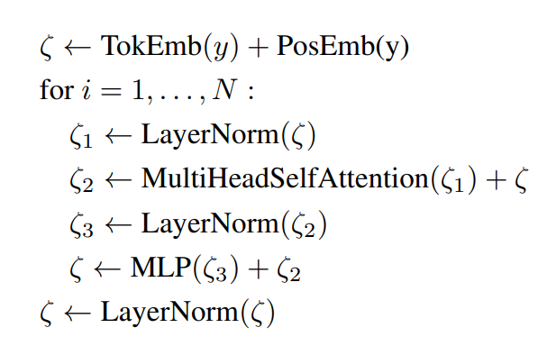
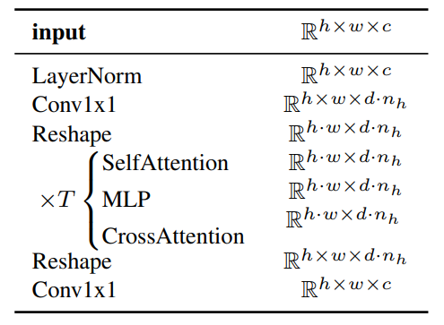

# Text To Image
## Sampler
- PLMSSampler
- DPMSolverSampler
- DDIMSampler

# LDM

# Conditional Mechanisms
In stable diffusion, UNet backbone is combined with the cross-attension mechanism
- https://arxiv.org/abs/2103.03206
- https://arxiv.org/pdf/2107.14795.pdf

## CrossAttension
[***Document***](https://github.com/Stability-AI/stablediffusion/blob/main/ldm/modules/attention.py)
```python
class CrossAttention(nn.Module):
    def __init__(self, query_dim, context_dim=None, heads=8, dim_head=64, dropout=0.):
        super().__init__()
        inner_dim = dim_head * heads
        context_dim = default(context_dim, query_dim)

        self.scale = dim_head ** -0.5
        self.heads = heads

        self.to_q = nn.Linear(query_dim, inner_dim, bias=False)
        self.to_k = nn.Linear(context_dim, inner_dim, bias=False)
        self.to_v = nn.Linear(context_dim, inner_dim, bias=False)

        self.to_out = nn.Sequential(
            nn.Linear(inner_dim, query_dim),
            nn.Dropout(dropout)
        )

    def forward(self, x, context=None, mask=None):
        h = self.heads

        q = self.to_q(x)
        context = default(context, x)
        k = self.to_k(context)
        v = self.to_v(context)

        q, k, v = map(lambda t: rearrange(t, 'b n (h d) -> (b h) n d', h=h), (q, k, v))

        # force cast to fp32 to avoid overflowing
        if _ATTN_PRECISION =="fp32":
            with torch.autocast(enabled=False, device_type = 'cuda'):
                q, k = q.float(), k.float()
                sim = einsum('b i d, b j d -> b i j', q, k) * self.scale
        else:
            sim = einsum('b i d, b j d -> b i j', q, k) * self.scale
        
        del q, k
    
        if exists(mask):
            mask = rearrange(mask, 'b ... -> b (...)')
            max_neg_value = -torch.finfo(sim.dtype).max
            mask = repeat(mask, 'b j -> (b h) () j', h=h)
            sim.masked_fill_(~mask, max_neg_value)

        # attention, what we cannot get enough of
        sim = sim.softmax(dim=-1)

        out = einsum('b i j, b j d -> b i d', sim, v)
        out = rearrange(out, '(b h) n d -> b n (h d)', h=h)
        return self.to_out(out)
```

*There might be small errors in the paper*
- $W_Q^{(i)} \in \mathbf{R}^{d \times d_{\epsilon}^i}$
- $W_K^{(i)} \in \mathbf{R}^{d \times d_{\tau}}$
- $W_V^{(i)} \in \mathbf{R}^{d \times d_{\tau}}$
# EMA
Exponential Moving Average
# Some Implementation Details
- text to image
- layout to image
## Conditioner $\tau_\theta$
An unmasked transformer :
- process tokenized y(tokenized input text)
- $\zeta := \tau_\theta(y)$, where $\zeta \in \mathbb{R}^{d \times d_\tau}$

## Transformer
Implemented from N transformer blocks consisting of global self-attention layers, layer-Norm and Position-wise MLPs
[Code Base](https://github.com/lucidrains/x-transformers)


# Appendix
## Diffusion Models Beat GAN
https://arxiv.org/pdf/2105.05233.pdf 

Including Architecture Inprovements

## Introducing U-Net into Diffusion

- https://arxiv.org/pdf/2006.11239.pdf
- https://arxiv.org/pdf/2009.05475.pdf

# DDPM
In the appendix B of the paper
- backbone [PixcelCNN++](https://arxiv.org/pdf/1701.05517.pdf)
    - U-Net based on Wide ResNet
    - replace weight Norm to Group Norm
- Each Resolution Level
    - 2 Convolutional Residual Blocks
    - Self-Attention at the 16 x 16 resolution between the Conv Blocks

# VAEs